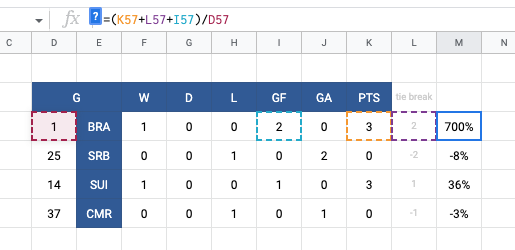

# 2022 World Cup Tracker

## Overview
I created a spreadsheet to track the schedule and scores of World Cup matches as well as predict the outcomes of upcoming matches based on the group stage scoring and overall 2022 FIFA rankings. 

## Google Sheet Link
https://docs.google.com/spreadsheets/d/1sbI19yQ8PaGcmO2SNnVhjbh0KvRn1CMm03SywlQ4MsU/edit?usp=sharing

## 2022-11-25: Initial Spreadsheet Functionality
### Group Stage
The group stage section of the spreadsheet is straightforward, matches are listed by date and local time of day, and conditional formatting is used to color each team name by the corresponding color of the group. Group color formatting is based on the colors used in the official Qatar branding/collateral. 

### Data Validation
Because unplayed matches do not have scores entered into their cells, the two blank cells are seen as a draw because they are of equal value. To prevent skewing the group standings, I added the `ISNUMBER` function to confirm a score had been entered into the cell.

### Group Standings
In the group stage, wins are worth 3 points, draws are worth 1 point, and losses are worth 0 points. To break ties in the group stage, the goal differential is added to the points (goals scored minus goals allowed). If there is still a tie, the overall number of goals is then added. 

### Score Weighting / Predictions
I added the tie-breaker calculations to help create a clear first and second place rank for each group, but early in the tournament these scores still tend to be fairly close or even identical.

Because so many matches are ending in low/no-score draws, I needed to further differentiate each team. This was accomplished by weighting the group standings by dividing the group round points by the team's 2022 FIFA ranking. \[[source](https://en.wikipedia.org/wiki/2022_FIFA_World_Cup_seeding)\]

After the first day of Group G matches, Brazil and Switzerland both won their matches, giving them 3 points each. Adding both the goal differential and overal number of goals scored, Brazil and Switzerland are statistically showing as still fairly equal, but Brazil is ranked #1 in the world, vs Switzerland's #14 ranking, so Brazil is much more likely to advance in the overall tournament. 

This also shows how dramatic an upset like the Argentina v Saudia Arabia game can skew the predictions. Even though Saudi Arabia is carrying Group C after the first day of matches due to the 0:0 draw with Mexico v Poland, the overall liklihood of them advancing to the finals is quite low due to their #49 worldwide ranking. The match between #4 Argentina and #9 Mexico on November 26 will likely show a dramatic change in the bracket predictions!

### Elimination Predictions
Games that have been populated by the predictive formulas are highlighted in light magenta to differentiate them from games that have been played and official final scores have been recorded.

